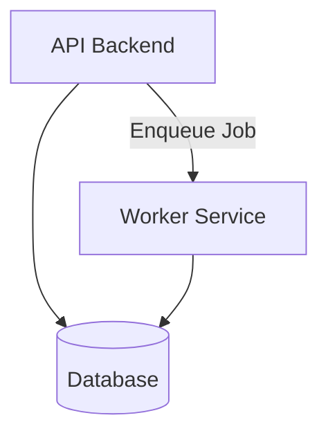

# Architecture Diagram

```mermaid
graph TD;
  API[API Backend]
  Worker[Worker Service]
  DB[(Database)]
  API -->|Enqueue Job| Worker
  API --> DB
  Worker --> DB
```

This diagram shows how the worker service processes jobs from the API and interacts with the database.